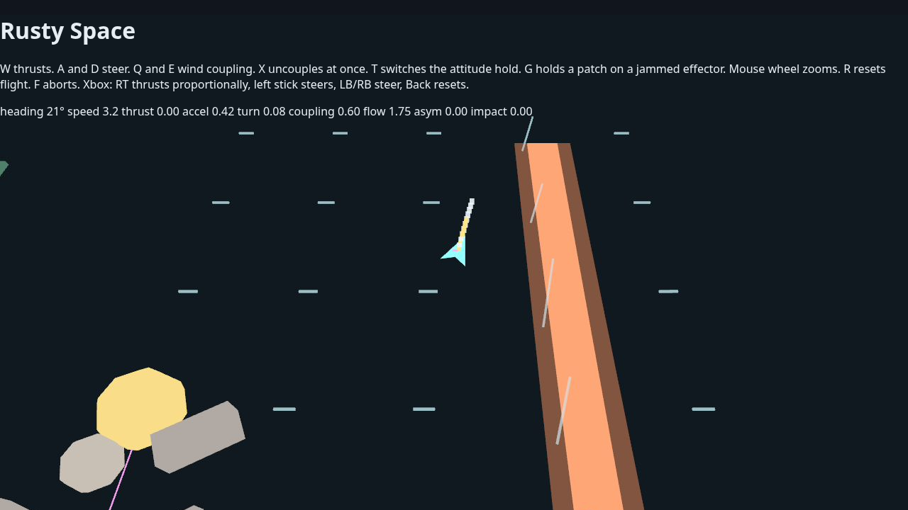
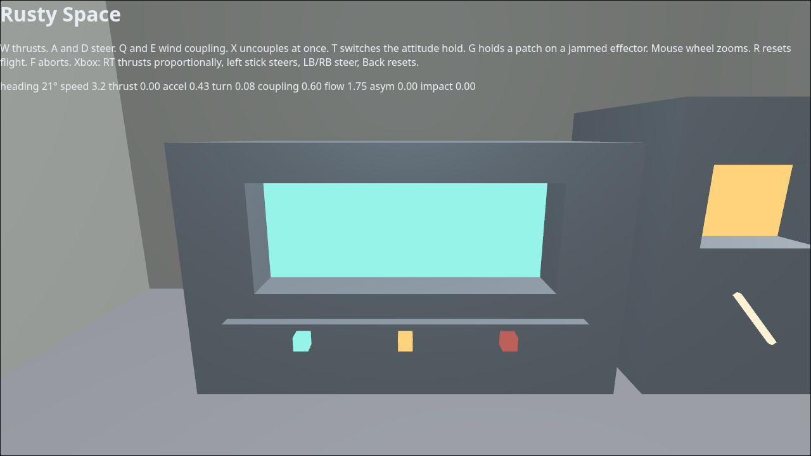

# Rusty Space

Rusty Space is a raw, evolving C# product built on the packaged Rusty Engine
SDK. `src/Product.Game/` contains the product logic and the SDK supplies its
CoreCLR and NativeAOT composition below ignored `obj/` paths. The ordinary
development and Den lane is CoreCLR through the matching `rusty dev` runtime;
NativeAOT is an explicit fidelity/release check.

> The product decides. The Engine guarantees.

C# owns flight meaning, product state, tuning, content meaning, policy, and
the small DOM UI projection. Rusty Engine owns lifecycle and update admission,
input, Dynamics, camera, appearance, rendering, canvas/backend, resources,
and host integration. If a needed mechanism is absent from the safe SDK,
record the exact upstream request and stop that slice; do not add a local
renderer, loop, bridge, or browser simulation.

## Demo





Captured at 1280×720 from a private local CoreCLR playtest with simulation
held: chart frame 566 at step 576, helm frame 568 at step 582. The helm uses
an ordinary C-key sit toggle followed by six admitted steps. These are the
original composite images, including the DOM HUD.

The runtime host renders the chart and bridge with wgpu and streams frames to
the browser's Engine-owned viewer; the browser also hosts the DOM flight HUD.
Captures carry the runtime frame sequence and simulation step. The runtime
host needs a GPU adapter; a remote browser needs only the frame viewer.

Audio plays on the runtime host, with `device-optional` selected explicitly.
Without a device the host warns once and continues silently. Remote browser
playtests cannot verify the drive hum or impact sound by listening.

## Repository shape

```text
src/
  Product.Game/     safe C# flight, field, presentation, and lifecycle code
  ui/               product-owned DOM UI only
content/            canonical product content and authored assets
Directory.Build.props  the one Engine SDK/runtime pair pin
docs/                current ownership and product design notes
```

The product runs on one exact Engine SDK/runtime pair, pinned by
`RustyEnginePackageVersion` in `Directory.Build.props`. The Engine's `rusty`
command (bootstrap:
`curl -fsSL https://raw.githubusercontent.com/FuzzySlipper/rusty-engine/main/scripts/install-rusty.sh | bash`)
installs it (`rusty install`), runs it (`rusty dev`) and moves it
(`rusty update`, which lists the release notes to read). Product content and the exploratory
design notes under `docs/ideas/` are intentional provenance and should not be
removed as host cleanup.

## Develop or use the Den service

Run the product on the pinned runtime:

```bash
rusty install
rusty dev \
  --project ./src/Product.Game/Product.Game.csproj \
  --live-debug --bind-host 127.0.0.1 --port 8787
```

`.den-serve.json` and `.den-playwright.json` use the same command.
The host stages the product-owned DOM UI and content. The runtime pack owns
the wgpu renderer in `rusty-product-host` and the
browser frame viewer. There is no downstream browser
bundle generator, Cargo product host, or checked NativeProduct project.

Engine contributors may opt into a source build only with an explicit
`--engine-source /absolute/path/to/rusty-engine` argument. That override
selects a matching source runtime and supplies the MSBuild properties needed
to use the source SDK. Ordinary product work must not discover adjacent
checkouts or invoke Cargo.

## Product slice

The current product is an inertial flight slice with fitted hardware and a
static, reactive bridge:

- `Flight` owns the inertial planar command model and Dynamics actions.
- `Field` owns the authored space-weather pushes — stellar flow and wake
  response, one gamey orbital well around the planet, and wide gentle plus
  narrow swift drift currents — all applied as Engine Dynamics forces.
- `Approach` authors the wrecks and boulders in the hull's Dynamics world.
- `ShipSystems` owns installed part response, damage, latches, and patch work.
- `Bridge` owns the static room and its instrument, light, prop, and audio reactions.
- `Navigation` owns the planar frame and sign convention.
- `Viewing` owns chart framing, zoom, and the seated helm camera.
- `Presentation` publishes the ship, planet, wake, current indicators,
  and HUD facts through Engine Appearance and UI services.
- `Debugging` reports flight and bridge facts; `Tuning` composes the authored settings.
- `Lifecycle` and `Composition` keep the product callback and dependency
  ordering explicit.

This is an experimentation base, not a claim of complete gameplay or broad
interactive certification. See [architecture](docs/architecture.md) and
[code style](docs/code-style.md) before changing the product/Engine boundary.

The next handling work is framed by
[space sailing campaign](docs/space-sailing-campaign.md): the canonical state
split, the invariants that keep inertial flight, authored ship systems, and
presentation from drifting into one another, and the known hazards. Sequencing
and status for that work live in Den project tasks, never in the repository.

## Controls

- Keyboard: W thrusts; A/D steer; E/Q wind coupling in/out; X emergency
  uncouples; T toggles attitude hold; C sits at the helm or returns to the
  chart; hold G to patch; R resets flight and bridge; F aborts. The mouse
  wheel zooms the chart.
- Xbox: RT provides proportional thrust, left-stick X steers, left-stick Y
  trims coupling, LB/RB steer digitally, Back resets, and hold button 9
  (right-stick press) to patch. Sit, attitude hold, emergency uncouple, and
  abort currently have no controller mapping.

## Verify

Run `./scripts/verify.sh` for the focused C# suite and CoreCLR staging on the
installed pin. The same gate runs in GitHub Actions as `CoreCLR verify`.
`./scripts/verify.sh --aot` additionally runs the NativeAOT fidelity check;
it is opt-in.

## Authored audio

Regenerate `content/audio/*.wav` with:

```bash
python3 scripts/generate-bridge-audio.py
```

The drive hum and impact thud are synthesized in this repository.

## Licence

The repository's own code, content, and documentation use the [MIT licence](LICENSE).
